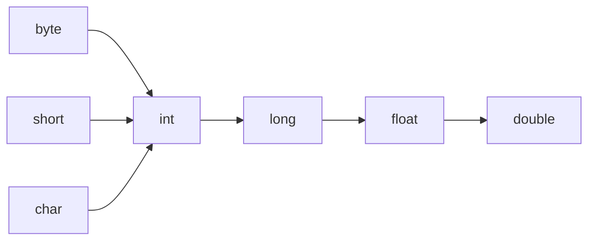

# 运算符

<font size=5 color="red">"==" 比较时，基本数据类型是数据值是否相同，引用类型是地址值是否相同</font>

## 算术运算符

> +、-、*、/、%
>
> /：整数除法只会得到整数，不会得到小数，要想得到小数，必须有浮点数参加

算术表达式中包含多个基本数据类型的值得时候，整个算术表达式的类型会自动进行提升

byte类型、short类型、char类型将被提升为int类型

等级顺序：



```java
char a = 'a';
int b = 10;
System.out.println(a+b);会报错
char的数据类型会被提升为int类型，所以必须得由一个int类型的变量接受，才能打印
int c = a+ b;
```

## 赋值运算符

>=、+=、-=、/=、%=

## 逻辑运算符

逻辑与：

&：无论左边真假，右边都会执行

短路与：

&&：如果左边为真，右边执行，如果左边位假，右边不执行

逻辑或：

|：无论左边真假，右边都会执行

短路或：

||：左边为假，右边执行，左边为真，右边不执行

异或：

^：相同为false，不同为true

非：

！：和正常结果相反

## 三元运算符

关系表达式 ? 表达式1 : 表达式2;

如果关系表达式的值为true表达式1的值就是运算结果

如果关系表达式的值为false表达式2的值就是运算结果

```java
public class Main {
  public static void main(String[] argv) {
    int denom = 10;
    int num = 4;
    double ratio;

    ratio = denom == 0 ? 0 : num / denom;
    System.out.println("ratio = " + ratio);
  }
}
// 结果：ratio:0.0
 // /：整数除法只会得到整数，不会得到小数，要想得到小数，必须有浮点数参加
```
