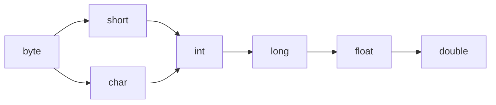

# 数据类型

计算机存储设备的最小单元叫"位（bit）"，又称之为比特位，用小写字母"b"

计算机中最小存储单元是"字节（byte）"，用大写字母"B"

字节是有连续的8个位组成

**1B = 8b**

**1KB = 1024B**

**1MB = 1024KB**

**1GB = 1024MB**

**1TB = 1024GB**

## 基本数据类型

- E+38表示乘以10的38次方、E-45表示乘以10的-45次方
- 整数默认是int类型、浮点数默认是double类型

### 数值型

#### 整数

##### byte

- 内存占用：1byte
  - byte 数据类型是8位、有符号的，以二进制补码表示的整数；
  - byte 类型用在大型数组中节约空间，主要代替整数，因为 byte 变量占用的空间只有 int 类型的四分之一
- 取值范围：-128~127
  - 最小值是 **-128（-2^7）**
  - 最大值是 **127（2^7-1）**
- 默认值是 **0**
- 例子
  - **byte a = 100，byte b = -50**

##### short

- 内存占用：2byte
  - short 数据类型是 16 位、**有符号的以二进制补码表示的整数**
  - Short 数据类型也可以像 byte 那样节省空间。一个short变量是int型变量所占空间的二分之一
- 取值范围：-32768~32767
  - 最小值是 **-32768（-2^15）**
  - 最大值是 **32767（2^15 - 1）**
- 默认值是 **0**
- 例子
  - **short s = 1000，short r = -20000**

##### int

- 内存占用：4byte
  - int 数据类型是32位、有符号的以二进制补码表示的整数
- 取值范围：-2的31次方到2的31次方-1
  - 最小值是 **-2,147,483,648（-2^31）**
  - 最大值是 **2,147,483,647（2^31 - 1）**
- 一般地整型变量默认为 int 类型
  - 默认值是 **0** 
- 例子
  - **int a = 100000, int b = -200000**

##### long

- 内存占用：8byte
  - long 数据类型是 64 位、有符号的以二进制补码表示的整数
- 这种类型主要使用在需要比较大整数的系统上
- 取值范围：-2的63次方到2的63次方-1
  - 最小值是 **-9,223,372,036,854,775,808（-2^63）**
  - 最大值是 **9,223,372,036,854,775,807（2^63 -1）**
- 默认值是 **0L**
- 例子
  - **long a = 100000L，Long b = -200000L**
  - "L"理论上不分大小写，但是若写成"l"容易与数字"1"混淆，不容易分辩。所以最好大写。

#### 浮点数

##### float

- 内存占用：4byte
  - float 在储存大型浮点数组的时候可节省内存空间
- float 数据类型是单精度、32位、符合IEEE 754标准的浮点数
  - 浮点数不能用来表示精确的值，如货币
- 取值范围
  - 正数：1.401298E-45 — 3.402823E+38
  - 负数：-3.402823E+38 — -1.401298E-45
- 默认值是 **0.0f**
- 例子
  - **float f1 = 234.5f**

##### double

- 浮点数的默认类型为double类型
  - double类型同样不能表示精确的值，如货币

- 内存占用：8byte
  - double 数据类型是双精度、64 位、符合IEEE 754标准的浮点数
- 取值范围
  - 正数：4.9000000E-324~1.797693E+308
  - 负数：-1.797693E+308~-4.9000000E-324
- 默认值是 **0.0d**
- 例子
  - **double d1 = 123.4**

#### 字符

##### char

- 内存占用：2byte
  - char类型是一个单一的 16 位 Unicode 字符
- char 数据类型可以储存任何字符
- 取值范围：0-65535
  - 最小值是 **\u0000**（即为0）
  - 最大值是 **\uffff**（即为65,535）
- 例子
  - **char letter = 'A'**

### 非数值型

#### 布尔

##### boolean

- 内存占用：1byte（boolean数据类型表示一位的信息；）
- 取值范围：true、false
- 默认值是 **false**
- 例子
  - **boolean one = true**

```java
   public static void main(String[] args) {  
        // byte  
        System.out.println("基本类型：byte 二进制位数：" + Byte.SIZE);  
        System.out.println("包装类：java.lang.Byte");  
        System.out.println("最小值：Byte.MIN_VALUE=" + Byte.MIN_VALUE);  
        System.out.println("最大值：Byte.MAX_VALUE=" + Byte.MAX_VALUE);  
        System.out.println();  
  
        // short  
        System.out.println("基本类型：short 二进制位数：" + Short.SIZE);  
        System.out.println("包装类：java.lang.Short");  
        System.out.println("最小值：Short.MIN_VALUE=" + Short.MIN_VALUE);  
        System.out.println("最大值：Short.MAX_VALUE=" + Short.MAX_VALUE);  
        System.out.println();  
  
        // int  
        System.out.println("基本类型：int 二进制位数：" + Integer.SIZE);  
        System.out.println("包装类：java.lang.Integer");  
        System.out.println("最小值：Integer.MIN_VALUE=" + Integer.MIN_VALUE);  
        System.out.println("最大值：Integer.MAX_VALUE=" + Integer.MAX_VALUE);  
        System.out.println();  
  
        // long  
        System.out.println("基本类型：long 二进制位数：" + Long.SIZE);  
        System.out.println("包装类：java.lang.Long");  
        System.out.println("最小值：Long.MIN_VALUE=" + Long.MIN_VALUE);  
        System.out.println("最大值：Long.MAX_VALUE=" + Long.MAX_VALUE);  
        System.out.println();  
  
        // float  
        System.out.println("基本类型：float 二进制位数：" + Float.SIZE);  
        System.out.println("包装类：java.lang.Float");  
        System.out.println("最小值：Float.MIN_VALUE=" + Float.MIN_VALUE);  
        System.out.println("最大值：Float.MAX_VALUE=" + Float.MAX_VALUE);  
        System.out.println();  
  
        // double  
        System.out.println("基本类型：double 二进制位数：" + Double.SIZE);  
        System.out.println("包装类：java.lang.Double");  
        System.out.println("最小值：Double.MIN_VALUE=" + Double.MIN_VALUE);  
        System.out.println("最大值：Double.MAX_VALUE=" + Double.MAX_VALUE);  
        System.out.println();  
  
        // char  
        System.out.println("基本类型：char 二进制位数：" + Character.SIZE);  
        System.out.println("包装类：java.lang.Character");  
        // 以数值形式而不是字符形式将Character.MIN_VALUE输出到控制台  
        System.out.println("最小值：Character.MIN_VALUE="  
                + (int) Character.MIN_VALUE);  
        // 以数值形式而不是字符形式将Character.MAX_VALUE输出到控制台  
        System.out.println("最大值：Character.MAX_VALUE="  
                + (int) Character.MAX_VALUE);  
    }  

基本类型：byte 二进制位数：8
包装类：java.lang.Byte
最小值：Byte.MIN_VALUE=-128
最大值：Byte.MAX_VALUE=127

基本类型：short 二进制位数：16
包装类：java.lang.Short
最小值：Short.MIN_VALUE=-32768
最大值：Short.MAX_VALUE=32767

基本类型：int 二进制位数：32
包装类：java.lang.Integer
最小值：Integer.MIN_VALUE=-2147483648
最大值：Integer.MAX_VALUE=2147483647

基本类型：long 二进制位数：64
包装类：java.lang.Long
最小值：Long.MIN_VALUE=-9223372036854775808
最大值：Long.MAX_VALUE=9223372036854775807

基本类型：float 二进制位数：32
包装类：java.lang.Float
最小值：Float.MIN_VALUE=1.4E-45
最大值：Float.MAX_VALUE=3.4028235E38

基本类型：double 二进制位数：64
包装类：java.lang.Double
最小值：Double.MIN_VALUE=4.9E-324
最大值：Double.MAX_VALUE=1.7976931348623157E308

基本类型：char 二进制位数：16
包装类：java.lang.Character
最小值：Character.MIN_VALUE=0
最大值：Character.MAX_VALUE=65535
```

### 引用数据类型

- 类
  - class

- 接口
  - interface

- 数组
  - []

# 类型转换

## 自动类型转换

- 表示把一个数据范围小的数值或变量赋值给另一个表示数据范围大的额变量
  - byte自动转char不成功，类型不兼容

## 强制类型转化

- 把一个数据表示范围大的数值或变量赋值给另一个表示数据范围小的变量
  - 目标数据类型 变量名 = (目标数据类型)值或者变量
  - int a = (int)99.123

## 数据范围从小到大顺序


