# WireShark

## 分析数据包技巧

1. 确定WireShark的位置【是否在公网上】
2. 选择捕获接口，一般都是internet网络接口
3. 使用捕获过滤器
4. 使用显示过滤器【捕获后的数据包还是很复杂，用显示过滤器过滤的更加细致】
5. 使用着色规则【更加突出某个会话】
6. 构件图表【看一个网络的数据变化，图表方式更直接】
7. 重组数据【大的文件会将信息分布在很多个数据宝忠】


## 工作模式

### 混杂模式

 - 接受所有经过网卡的数据包，包括不是发给本地的数据包【即不验证MAC地址】

#### 混杂模式的开启

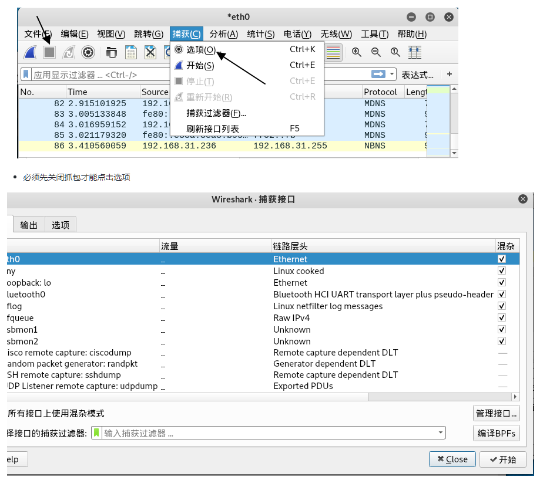

### 普通模式

 - 普通模式下只接收发给本地的数据包（包括广播包）传递给上层程序，其他的包一律丢弃


## 协议分析

### ARP协议

#### ARP协议介绍

 - ==地址解析协议==，是一个通过解析网络层地址来找寻数据链路层地址的网络传输协议，它在IPV4中很重要【ARP是通过网络地址来定位MAC地址】

#### ARP包内容

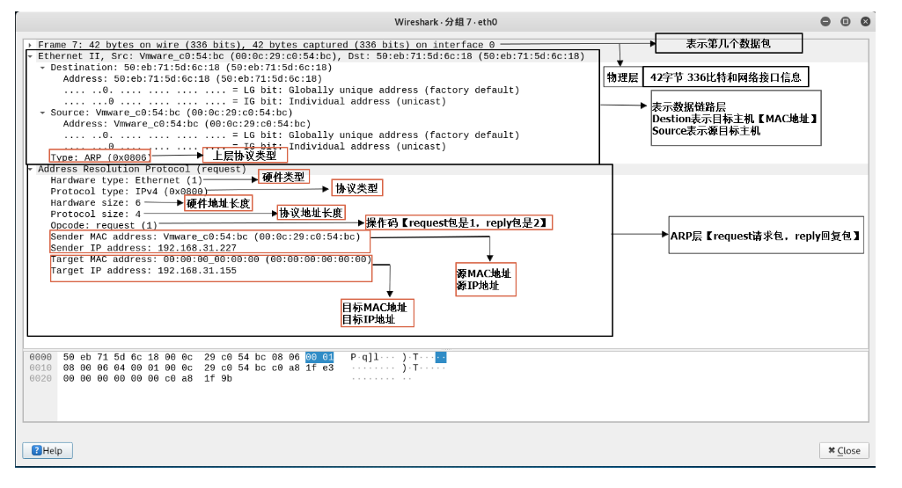

#### ARP协议工作流程

> 看到应答包补全了自己的MAC地址，目的地址和源地址做了替换<br>
```
192.168.31.155 广播：谁有192.168.31.1的MAC地址？
192.168.31.1 应答：192.168.31.1的MAC地址是xxxxxxxx
```


### ICMP协议

#### ICMP协议介绍

 - 它是TCP/IP协议簇的一个子协议，用于在IP主机、路由器之间传递控制消息。控制消息是指网络通不通、主机是否可达、路由是否可用等网络本身的消息。这些控制消息虽然并不传输用户数据，但是对于用户数据的传递起着重要的作用

#### ICMP包内容

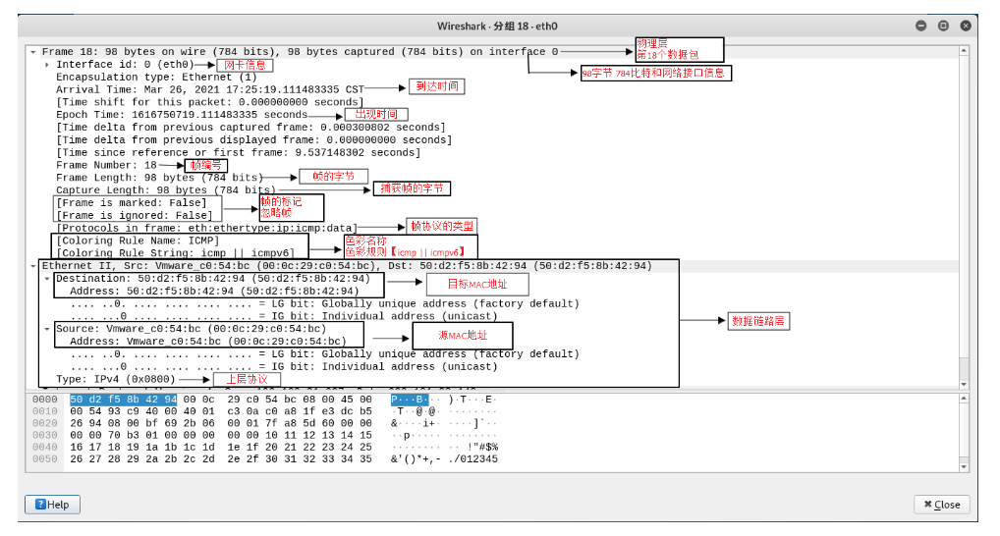

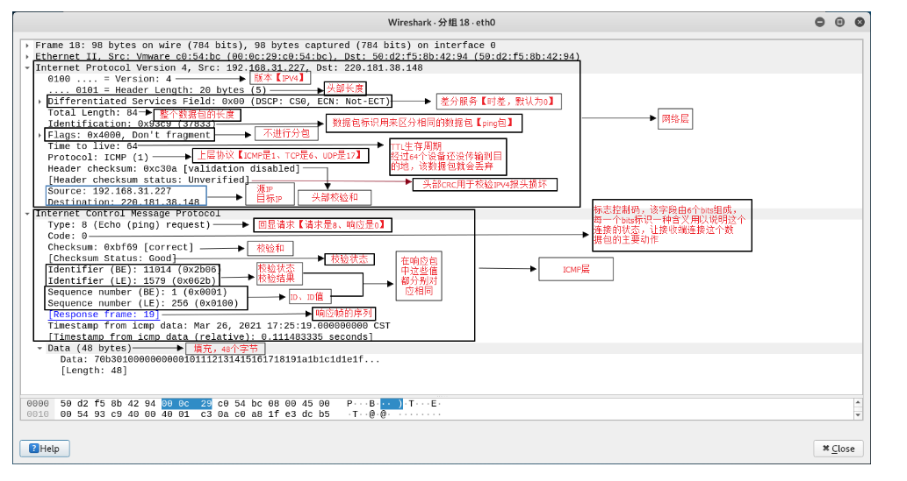

#### ICMP协议工作流程

  > 本机发送一个ICMP Request包<br>
  > 接收方返回一个ICMP Reply包，包含了接收到的数据拷贝和一些其他指令


### HTTP协议

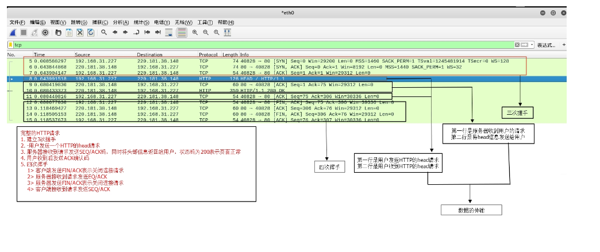

### TCP协议

#### TCP三次握手

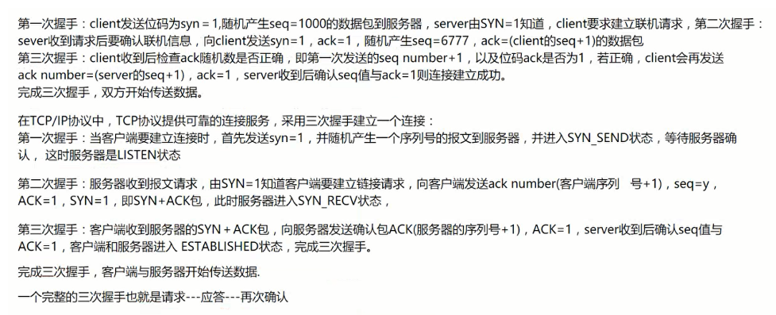

 - 第一次握手

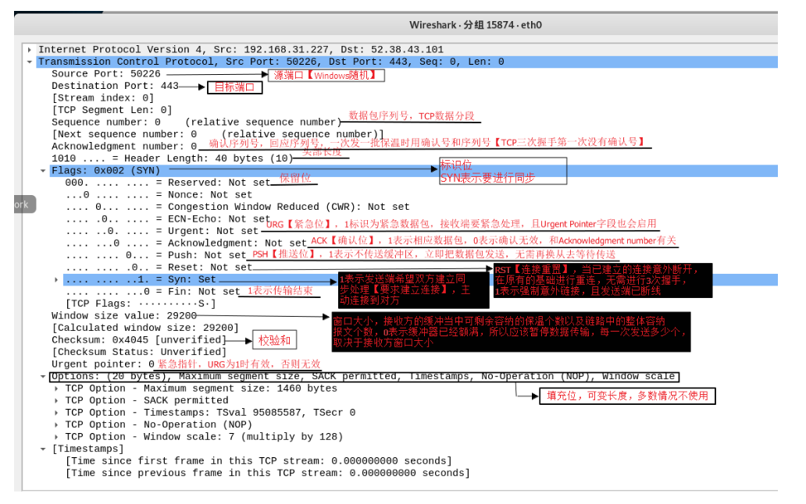

 - 第二次握手

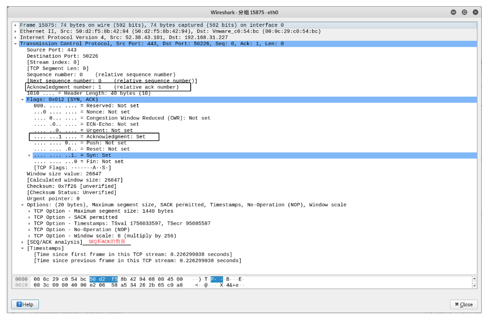

 - 第三次握手

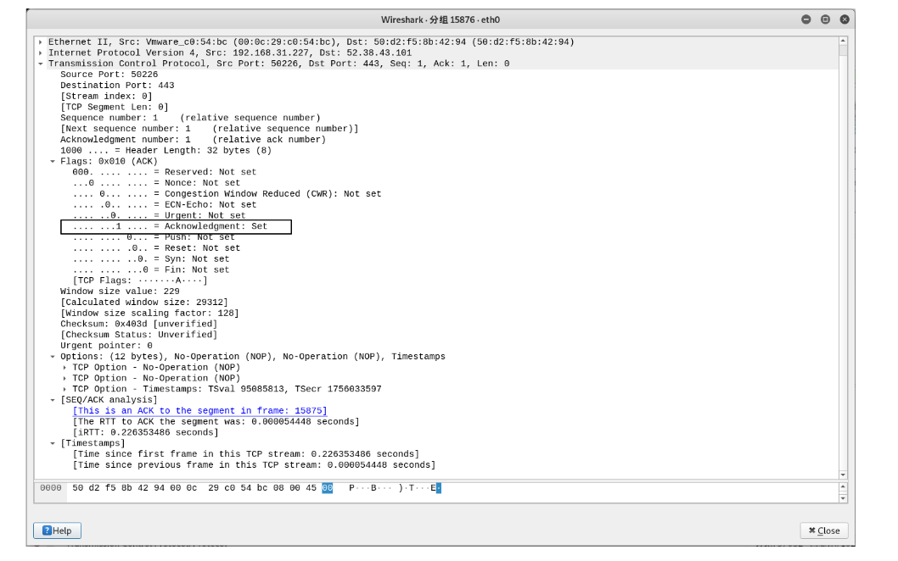


#### TCP四次挥手


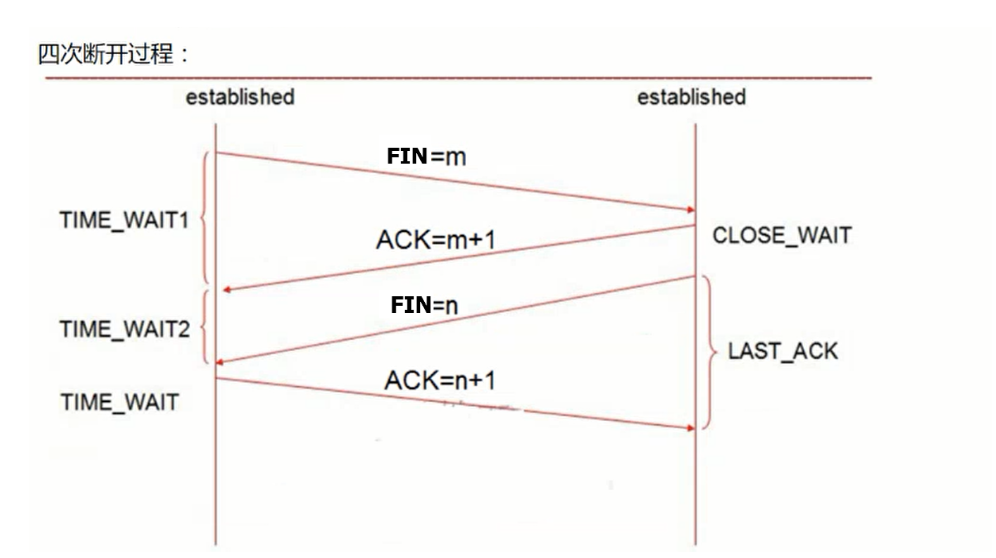

### UDP-DNS协议

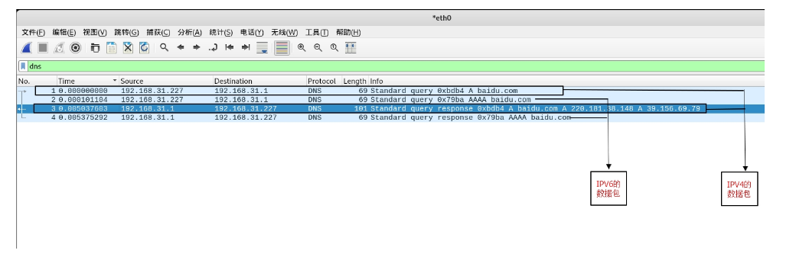

 - 请求包

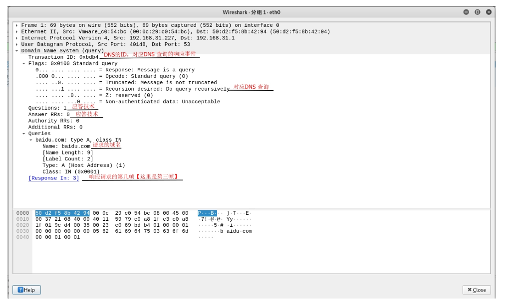

 - 响应包

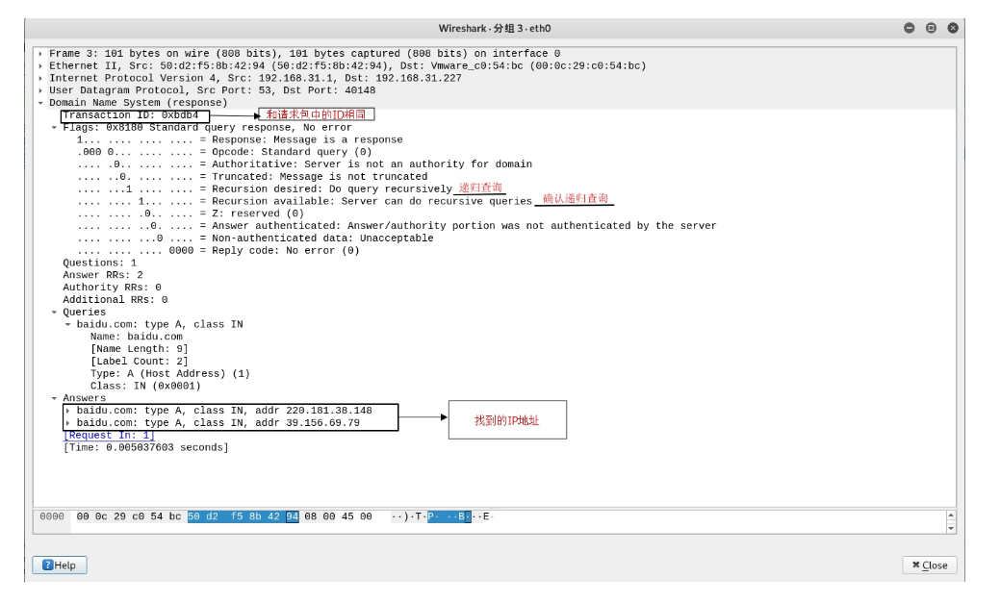

## 常用指令

### 运算符
<table border="1">
    <tr>
        <th colspan="2">比较运算符</th>
        <th colspan="2">逻辑运算符</th>
    </tr>
    <tr>
        <td>运算符</td>
        <td>说明</td>
        <td>运算符</td>
        <td>说明</td>
    </tr>
    <tr>
        <td>eq ==</td>
        <td>等于</td>
        <td>and &&</td>
        <td>逻辑与</td>
    </tr>
    <tr>
        <td>ne !=</td>
        <td>不等于</td>
        <td>or ||</td>
        <td>逻辑或</td>
    </tr>
    <tr>
        <td>gt ></td>
        <td>大于</td>
        <td>xor ^^</td>
        <td>逻辑异或</td>
    </tr>
    <tr>
        <td>lt <</td>
        <td>小于</td>
        <td>not !</td>
        <td>逻辑非</td>
    </tr>
    <tr>
        <td>ge >=</td>
        <td>大于等于</td>
    </tr>
    <tr>
        <td>le <=</td>
        <td>小于等于</td>
    </tr>
</table>

### 常见的过滤器

#### 协议过滤器

##### 语法

> Protocal String String Comparsion opertor Value LogicalOptions Other expression

> 协议 值 值 比较运算符 值 逻辑运算符 其他协议

##### 案例

```
显示POST提交的数据包或者是ICMP包<br>
http.request.method=="POST" or icmp.type<br>

显示IP地址为192.168.31.135的数据包<br>
id.addr==192.168.31.135<br>

显示来自10.20.0.0/16网段数据包<bR>
ip.src=10.20.0.0/16<br>

显示主机为192.168.30.33的相关数据包<br>
ip.host==192.168.30.33<br>

显示http响应状态码为302的相关数据包<br>
http.code==302<br>

显示TCP端口号为80的数据包<br>
tcp.port==80<br>

显示目的TCP端口为80的数据包<br>
tcp.dstport==80
```

#### 内容过滤器

##### 格式

> contains [包含]

##### 案例

```
显示包含"http"字符串的TCP数据包<br>
tcp contains "http"<br>

显示包含主机192.168.31.5的数据包<br>
http.host contains 192.168.31.5
```


## 案例【解决服务器无法上网】

### TTL

> Linux默认的TTL为64，每经过一个路由节点，TTL减1，TTL为0时，说明目标不可达并返回==Time to live exceeded==

> TTL：数据报文的生存周期

> TTL的作用：防止数据包在公网无限制转发

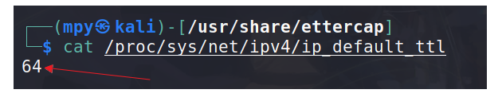

### 模拟场景

> 修改主机 TTL 值为 1，下面的方式是我们临时修改内核参数。

```
echo "1" > /proc/sys/net/ipv4/ip_default_ttl
```

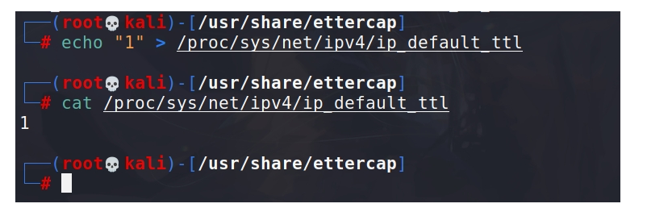

1. 单独ping网关【网关：192.168.31.1】

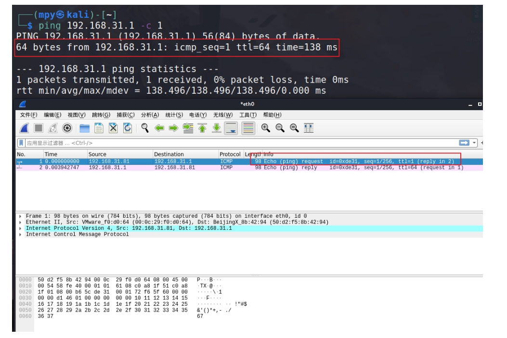

> 可以ping通

2. ping一个网络地址

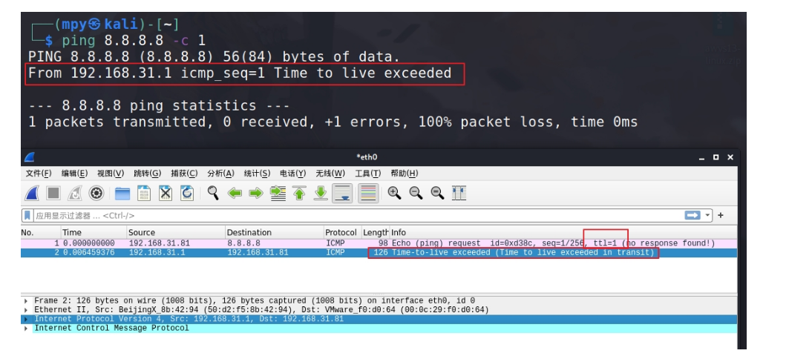

> 无法ping通，并返回了Time to live exceeded

<font size = 4>再次修改一下TTL值</font>

```
echo "2" > /proc/sys/net/ipv4/ip_default_ttl
```

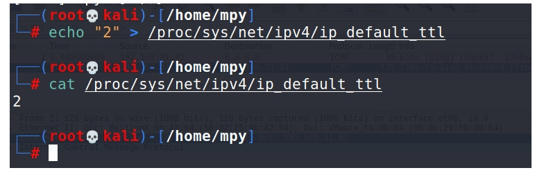

3. 再次ping网络地址

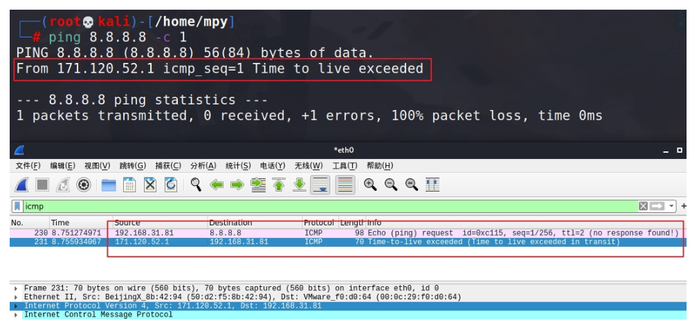

 - 发现虽然返回的是==Time to live exceeded==，但是返回的IP地址不是网关，这证明了==数据包在网络中
已经到达了下一个网络设备才被丢弃==，由此我们还判断出我们的运营商网关地址为 171.120.52.1 但是我们并没有到达目标主机

<font size = 4>修改回原来的TTL值</font>

```
echo "64" > /proc/sys/net/ipv4/ip_default_ttl
```

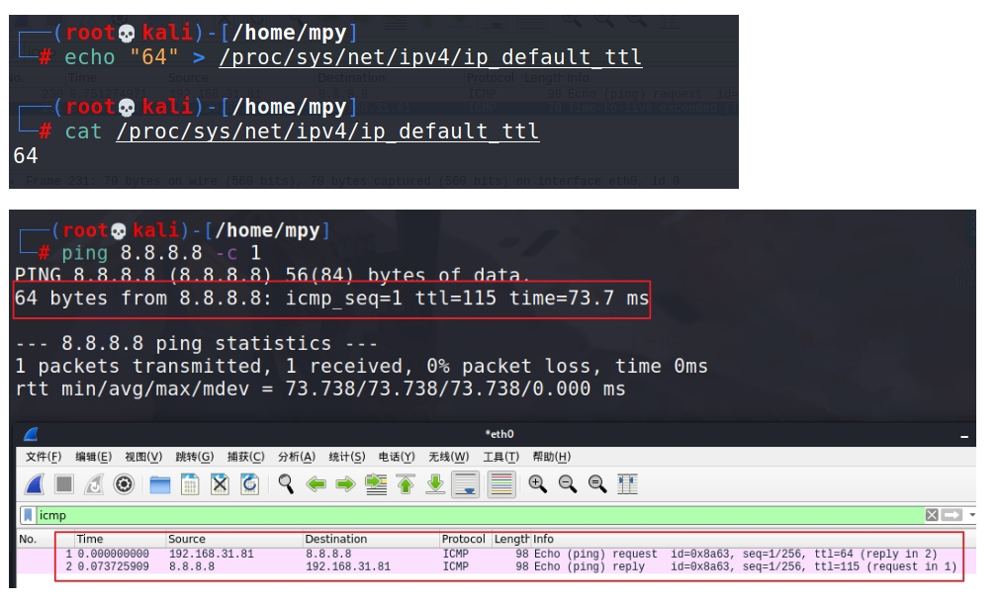

### MTR

 - 可以检测我们到达目标网络乊间的所有网络设备的网络质量，默认系统是没有安装 MTR 工具的我们手劢安装一下

```
apt install mtr
```

 - 检测到达 8.8.8.8 所有节点的通信质量

```
mtr 8.8.8.8
```

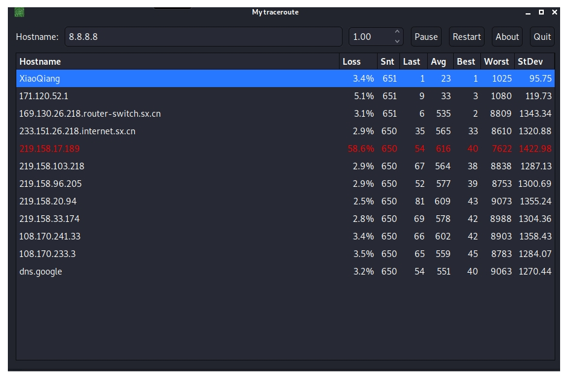

 - 我们可以看到从我当前主机到目标主机间经过 12 跳