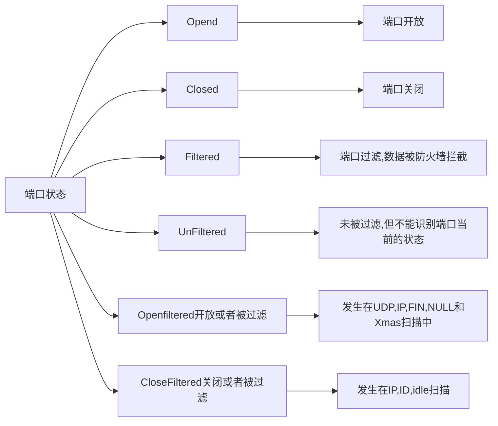
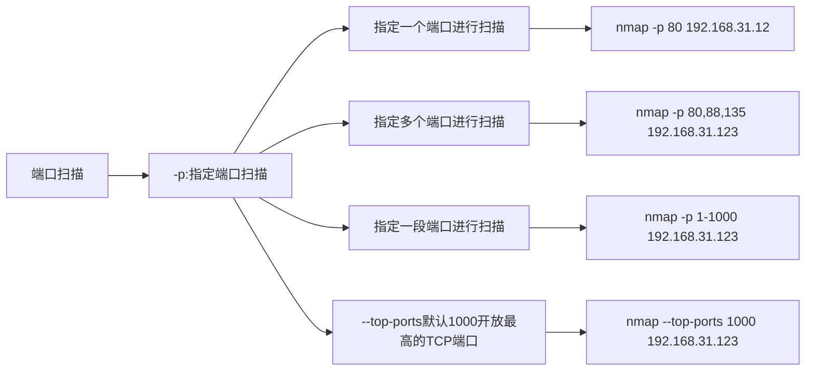
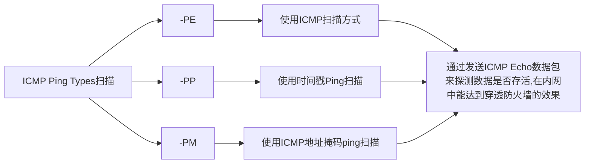
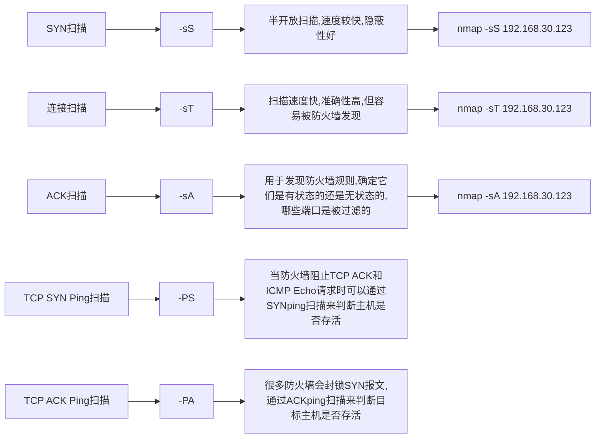
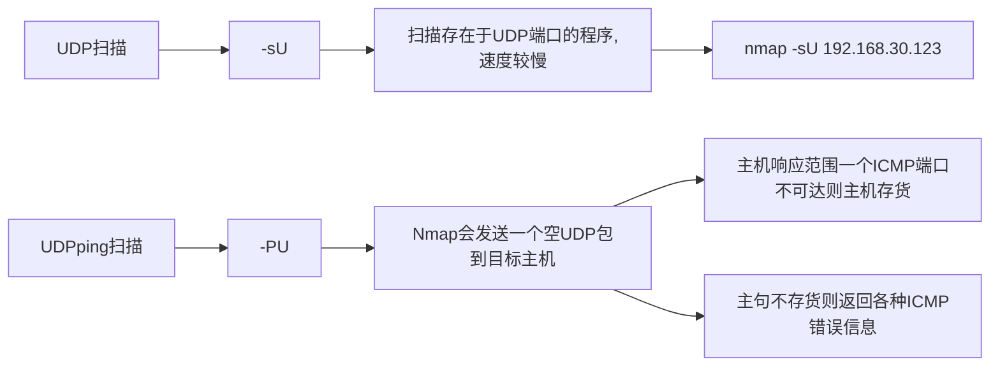
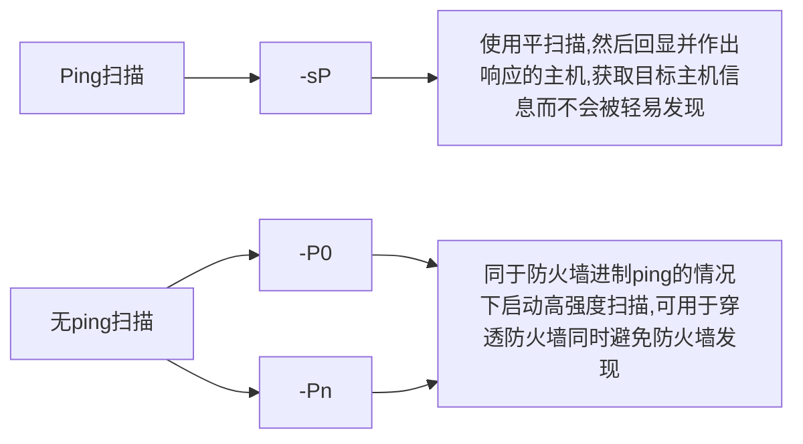
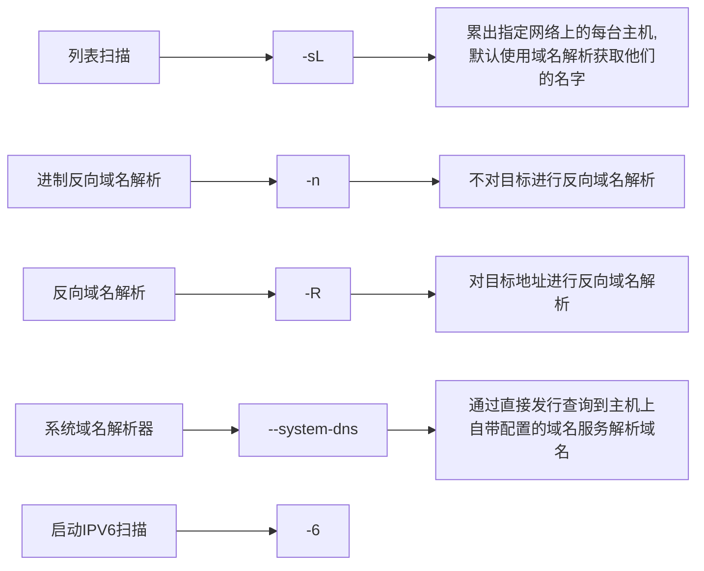
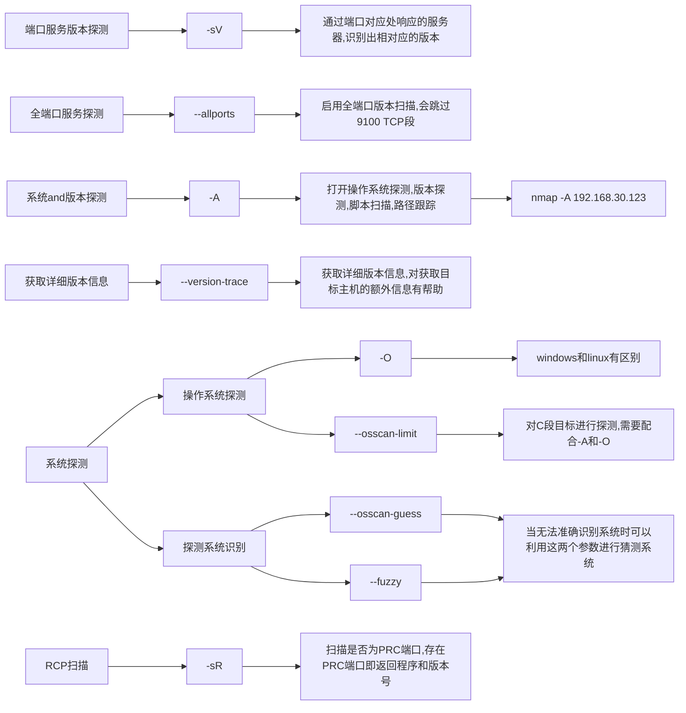
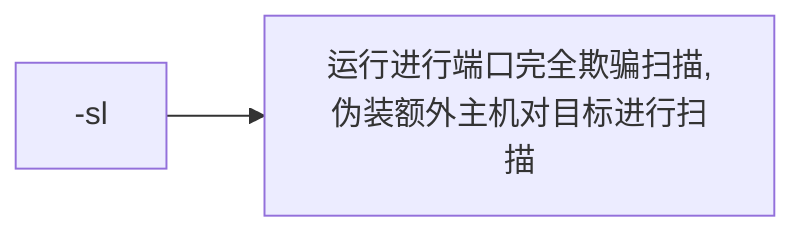
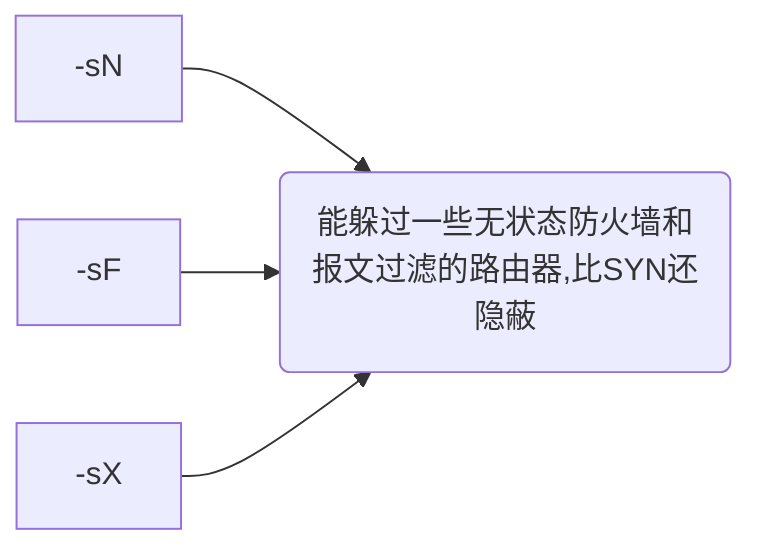

# Nmap
<!--TB - top bottom（自上而下）-->
<!--BT - bottom top（自下而上）-->
<!--RL - right left（从右到左）-->
<!--LR - left right（从左到右）-->

## 常见扫描方式

1. 无任何附加参数

> nmap 192.168.31.177
> > 如果是超级用户，无参数扫描相当于是sS扫描 
> > 其他用户相当于sT扫描【TCP 完整扫描】

2. 指定端口

> nmap -p 8080 192.168.30.177

3. 系统探测

> nmap -O 192.168.30.177 
> nmap -A 192.168.30.177

4. 主机发现

> nmap -sn 192.168.30.177 【只是用ping扫描来发现】

5. 跳过主机发现

> nmap -Pn 192.168.30.177 【穿透防火墙】

6. 扫描和版本号侦测

> nmap -sV 192.168.30.177 【侦测开放的端口来判断开放的服务，并检测对应的版本】

7. UDP扫描

> nmap -sU 192.168.30.177

8. TCP扫描

> nmap -sT 192.168.30.177

9. STCP扫

【通过STCP协议进行扫描主机】
> nmap -PY 192.168.30.177

10. 漏洞扫描

> nmap --script=vuln 192.168.30.177 【使用vuln脚本扫描漏洞】

11. IPV6扫描

> nmap -6 192.168.30.177

12. 路由跟踪
 
【帮助用户了解网络情况，可以查出本地计算机到目标之间所经过的网络节点并可以查看到通过各个节点的时间】

> nmap 192.168.30.177 -traceroute

13. 保存输出

> 标准输出 【txt格式的】
>
> > nmap -oN test.txt

> XML输出【XML格式的】
>
> > nmap -oX test.xml

## 端口扫描

### 端口状态

## ARP 扫描

## ICMP扫描

## TCP扫描

## UDP扫描

## Ping扫描

## 其他扫描

### 域名扫描

### 指纹识别

### 空闲扫描

### 隐藏扫描

## 信息收集

1. WhoIs查询

> 脚本名称：whois-domain.nse 【查询目标WhoIs信息】 
> nmap --script=whois-domain.nse 192.168.30.177

2. DNS信息收集

> 脚本名称：dns-brute.nse 【通过DNS记录进行查询并且进行爆破】 
> nmap --script=dns-brute.nse 192.168.30.177

3. 扫描WEB漏洞

> 脚本名称：http:stored-xss.nse 【扫描XSS】 
> nmap --script=http:stored-xss.nse 192.168.30.177  
> 还有很多脚本

## 漏洞利用

1. 检测MySQL密码

> 脚本名称：mysql-empty-password 【检查目标是否存在弱口令或者密码为root】 
> nmap --script=mysql-empty-password 192.168.30.177  

2. FTP服务认证

> 脚本名称：ftp-brute【爆破目标是否存在弱口令】 
> nmap --script=ftp-brute 192.168.30.177 -p 21 

> 使用字典  
> nmap --script=ftp-brute --script-args userdb=user.txt,passdb=pass.txt 192.168.30.177 -p 21

3. wordpress认证

> 脚本名称：http-wordpress-brute  
> nmap --script=http-wordpress-brute 192.168.30.177 -p 80

> 使用字典  
> nmap --script=http-wordpress-brute --script-args userdb=user.txt,passdb=pass.txt 192.168.30.177 -p 80

